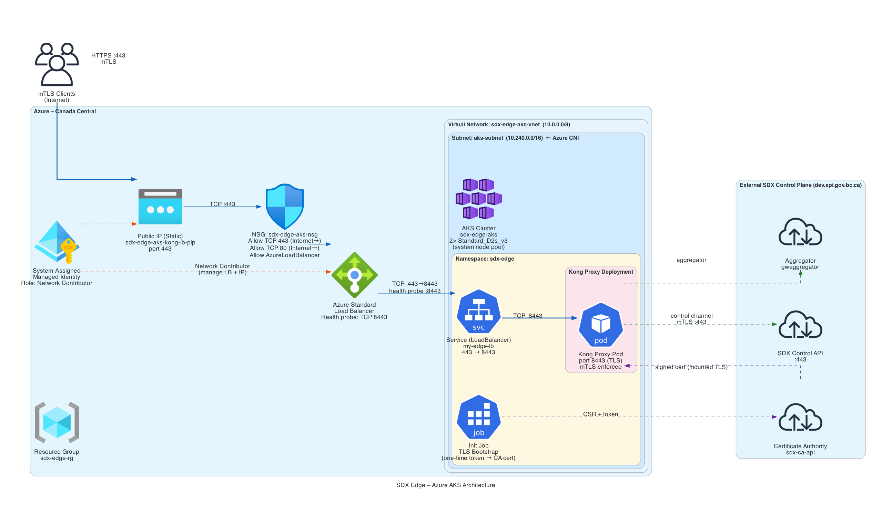

# Edge Server in Azure



## Deployment

### Terraform

See PROMPT.md

### Prepare bootstrap token

Bootstrap will initially fail, but retrieve the public ip from `kong_lb_ip`.

```sh
terraform apply -target azurerm_public_ip.kong_lb

export IP="20.63.103.28"
export EDGE_ID="azure01"
export DOMAIN="${EDGE_ID}.servers.sdx"

step ca token $DOMAIN \
  --san $DOMAIN \
  --san $IP > token
```

### AKS Admin

```sh
az aks get-credentials --resource-group sdx-edge-rg --name sdx-edge-aks

kubectl create serviceaccount admin --namespace default

kubectl create clusterrolebinding admin \
  --clusterrole=cluster-admin \
  --serviceaccount=default:admin

kubectl -n default create token admin

```

### AKS Dashboard

```sh
helm repo add kubernetes-dashboard https://github.io

helm upgrade --install kubernetes-dashboard kubernetes-dashboard/kubernetes-dashboard --create-namespace --namespace kubernetes-dashboard

kubectl -n kubernetes-dashboard port-forward svc/kubernetes-dashboard-kong-proxy 8443:443

```

> Check logs

### Verify Edge Server

Successful terraform completion produces output like:

```sh
aks_cluster_name = "sdx-edge-aks"
aks_get_credentials = "az aks get-credentials --resource-group sdx-edge-rg --name sdx-edge-aks"
edge_domain = "azure01.servers.sdx"
helm_release_status = "deployed"
kong_lb_ip = "20.63.46.159"
resource_group_name = "sdx-edge-rg"
```

Run the following to check connectivity to the SDX Edge Server:

```sh
curl -v -k --resolve ${DOMAIN}:443:${IP} \
  https://${DOMAIN}
```

## Simple image

```sh
az acr login --name acrmyapp
docker build --platform linux/amd64 -t acrmyapp.azurecr.io/showme:latest oci/showme
docker push acrmyapp.azurecr.io/showme:latest
```

## UDR Request for internet facing

```yaml
subscription_id: 8e303ae8-ce14-4e85-9dc3-9d767a42dec8
resource_group_name: sdx-edge-rg
virtual_network_name: b9cee3-test-vwan-spoke
subnet_name: appgw-subnet
udr_name: sdx-edge-aks-appgw-udr
routes: |-
  [
    {
      "name": "default-internet",
      "addressPrefix": "0.0.0.0/0",
      "nextHopType": "Internet"
    },
    {
      "name": "bcgov-internal",
      "addressPrefix": "142.34.0.0/16",
      "nextHopType": "Internet"
    }
  ]
```

## Diagrams

```text
can you create an architecture diagram as a PNG based on the terraform resources that were created using Azure icons, VNet + subnet layout and ingress flow down to pod-level detail
```

````text
can you update gen_diagram.py and use the terraform.tfstate and the .tf files in this folder to generate a png describing the architecture in a network view and one in
  a logical service view, and one in a resource-based view.  Use Azure icons where possible.
─--

## BC Gov Landing Zone

### Application Gateway Health

Wait for "Succeeded"

```sh
az network application-gateway show \
    --resource-group sdx-edge-rg \
    --name sdx-edge-aks-appgw \
    --query "{state:provisioningState,opState:operationalState}" -o table
````

## Troubleshooting

### Application Gateway (with LB)

UDR caveat (may require BC Gov service request): This is the same issue that originally blocked AppGW. AppGW is in a Landing Zone subnet — if a UDR routes outbound traffic through the hub firewall, AppGW's packets to the Kong public IP (20.63.99.116) will hit that firewall. The firewall needs a rule permitting appgw-subnet kong-pip:443. This is outside what Terraform can control; it requires a BC Gov networking request.

### Application Gateway (with Node backend pools)

Note: This is a workaround to avoid raising a UDR. Still time out.

Set the App Gateway backend pool nodes to the nodes from AKS.

- App Gateway backend state : Make sure it is "provisioned"

### Global CDN Front Door

Traffic is blocked.

## Appendix

```sh
az network application-gateway show \
  --name sdx-edge-aks-appgw \
  --resource-group sdx-edge-rg \
  --query "{state:operationalState, provisioning:provisioningState}"


  az network vnet subnet list \
    --vnet-name b9cee3-test-vwan-spoke \
    --resource-group b9cee3-test-networking \
    --query "[].{name:name, routeTable:routeTable.id}" \
    --output table

az provider show --namespace Microsoft.Network \
    --query "resourceTypes[?resourceType=='applicationGateways'].apiVersions[]" \
    --output table


 az network lb address-pool address list \
     --resource-group sdx-edge-rg \
        --lb-name sdx-edge-aks-kong-lb \
        --pool-name kong-nodes \
    -o table

az afd origin show \
    --resource-group sdx-edge-rg \
    --profile-name sdx-edge-aks-afd \
    --origin-group-name kong \
    --origin-name kong \
    --query "deploymentStatus"


```

```sh
KONG_IP=$(az network public-ip show \
  --resource-group sdx-edge-rg \
  --name sdx-edge-aks-kong-pip \
  --query ipAddress -o tsv)

RG=sdx-edge-rg
PROFILE=sdx-edge-aks-afd

for cmd in \
 "afd profile show --profile-name $PROFILE" \
  "afd endpoint show --profile-name $PROFILE --endpoint-name sdx-edge-aks-ep" \
  "afd origin-group show --profile-name $PROFILE --origin-group-name kong" \
  "afd origin show --profile-name $PROFILE --origin-group-name kong --origin-name kong" \
  "afd route show --profile-name $PROFILE --endpoint-name sdx-edge-aks-ep --route-name kong" \
  "afd security-policy show --profile-name $PROFILE --security-policy-name sdx-edge-aks-sec"; do
  echo -n "$cmd → "
az $cmd --resource-group $RG --query deploymentStatus -o tsv
done

```

```sh
az monitor activity-log list \
  --resource-group sdx-edge-rg \
  --offset 24h \
  --query "[?contains(resourceId,'frontdoor') || contains(resourceId,'afd')].{status:status.value, op:operationName.value, msg:properties.statusMessage}" \
  -o table 2>/dev/null | head -40


terraform apply \
    -replace=azurerm_public_ip.kong_lb \
    -replace=azurerm_lb.kong  \
    -replace=azurerm_cdn_frontdoor_route.kong \
    -replace=azurerm_cdn_frontdoor_origin.kong
```

Origin health

```sh
az afd origin show \
    --resource-group sdx-edge-rg \
    --profile-name sdx-edge-aks-afd \
    --origin-group-name kong \
    --origin-name kong \
    --query "{deployment:deploymentStatus,enabled:enabledState}" -o table


 az network public-ip show \
    --resource-group sdx-edge-rg \
    --name sdx-edge-aks-kong-pip \
    --query "{ip:ipAddress,fqdn:dnsSettings.fqdn}" -o table

```

```sh


RG=sdx-edge-rg
P=sdx-edge-aks-afd

alias afd="az afd"

az configure --defaults group=$RG

for r in \
  "afd profile show --profile-name $P" \
  "afd endpoint show --profile-name $P --endpoint-name sdx-edge-aks-ep" \
  "afd origin-group show --profile-name $P --origin-group-name kong" \
  "afd security-policy show --profile-name $P --security-policy-name sdx-edge-aks-sec"; do \
  echo "$r: $(az $r --resource-group $RG --query deploymentStatus -o tsv)"
done
```

```sh
terraform apply \
  -replace=azurerm_cdn_frontdoor_profile.main \
  -replace=azurerm_cdn_frontdoor_firewall_policy.main \
  -replace=azurerm_cdn_frontdoor_endpoint.main \
  -replace=azurerm_cdn_frontdoor_origin_group.kong \
  -replace=azurerm_cdn_frontdoor_origin.kong \
  -replace=azurerm_cdn_frontdoor_route.kong \
  -replace=azurerm_cdn_frontdoor_security_policy.main
```

```sh
az network lb probe show \
    --resource-group sdx-edge-rg \
    --lb-name sdx-edge-aks-kong-lb \
    --name kong-nodeport-tcp
```

```sh
az network application-gateway address-pool update \
  --gateway-name "sdx-edge-aks-appgw" \
  --resource-group "sdx-edge-rg" \
  --name "kong-backend" \
  --servers 10.46.8.133,10.46.8.132

```

### App Gateway backend state

```sh
az network application-gateway show \
    --resource-group sdx-edge-rg \
    --name sdx-edge-aks-appgw \
    --query "{provisioning:provisioningState,operational:operationalState,backends:backendAddressPools[0].backendAddresses}" \
    -o json

az afd endpoint show \
    --resource-group sdx-edge-rg \
    --profile-name sdx-edge-aks-afd \
    --endpoint-name sdx-edge-aks-ep \
    --query deploymentStatus -o tsv

az afd origin-group list \
    --resource-group sdx-edge-rg \
    --profile-name sdx-edge-aks-afd \
    --query deploymentStatus -o tsv
```

```sh
az network application-gateway show \
    --resource-group sdx-edge-rg \
    --name sdx-edge-aks-appgw \
    --query "{state:provisioningState,opState:operationalState}" -o table

az policy state list \
    --resource-group sdx-edge-rg \
    --query "[?complianceState=='NonCompliant'].{policy:policyDefinitionName,resource:resourceId}" \
    -o table
```

## PFX FILE

```sh
openssl pkcs12 -export -out cert.pfx -inkey key.pem -in cert.pem

CERT=$(base64 -i cert.pfx | tr -d '\n')
```

## Testing SDX Edge Server routing

Run from inside AKS

```sh
# service cluster IP
export IP=10.10.67.65
export EDGE_ID="azure01"
export DOMAIN="${EDGE_ID}.servers.sdx"

curl -v --resolve ${DOMAIN}:443:${IP} \
  --cacert /etc/secrets/sdx-edge-ca/ca.crt \
  --cert /etc/secrets/sdx-edge-client-cert/tls.crt \
  --key /etc/secrets/sdx-edge-client-cert/tls.key \
  -H "X-Client-Id:LAB.MIN.CITZ.SDG-FE" \
  https://${DOMAIN}/sdx/0/LAB.MIN.CITZ.AZURE01.v1/v1/me
```

```
export IP=20.63.103.28
export EDGE_ID="azure01"
export DOMAIN="${EDGE_ID}.servers.sdx"

curl -v --resolve ${DOMAIN}:443:${IP} \
  -H "X-Client-Id:LAB.MIN.CITZ.SDG-FE" \
  https://${DOMAIN}/sdx/0/LAB.MIN.CITZ.AZURE01.v1/v1/me

```

## Cert Chain

```sh
openssl s_client -connect sdx-edge-aks-hello.orangewater-f8b9c6ec.canadacentral.azurecontainerapps.io:443 -showcerts 2>/dev/null
```

## Security Advisories

### CVE-2026-31431

https://portal.azure.com/#view/Microsoft_Azure_Health/DetailsPage.ReactView/fromDeeplink~/false/index~/0/selectedEventSummary~/%7B%22trackingId%22%3A%224Y6C-C0G%22%2C%22scope%22%3A%22Subscription%22%2C%22impactedSubscriptions%22%3A%5B%228e303ae8-ce14-4e85-9dc3-9d767a42dec8%22%5D%2C%22eventType%22%3A%22SecurityAdvisory%22%2C%22impactStartTime%22%3A%22Thu%20Apr%2030%202026%2017%3A00%3A01%20GMT-0700%20(Pacific%20Daylight%20Time)%22%2C%22isEventSensitive%22%3Afalse%7D/trackingId/4Y6C-C0G/impactedSubs~/%5B%228e303ae8-ce14-4e85-9dc3-9d767a42dec8%22%5D/scope/Subscription/eventType/SecurityAdvisory/impactStartTime/Thu%20Apr%2030%202026%2017%3A00%3A01%20GMT-0700%20(Pacific%20Daylight%20Time)

On each affected Linux node pool:

- If running a node image older than 202604.24.0: Upgrade the node image:

```sh
az aks nodepool list --resource-group sdx-edge-rg --cluster-name sdx-edge-aks

az aks nodepool upgrade --resource-group sdx-edge-rg --cluster-name sdx-edge-aks --name system --node-image-only
```

- If already on 202604.24.0: No upgrade target exists. Apply the self-service mitigation DaemonSet from the AKS advisory for immediate, non-disruptive protection.

**CVE-2026-31431 Mitigation:**

- Before upgrade: `nodeImageVersion=AKSUbuntu-2204gen2containerd-202604.13.0`

```sh
az aks nodepool list --resource-group sdx-edge-rg --cluster-name sdx-edge-aks
```

- Perform upgrade (RollingUpgradeCreatingSurgeNodes)

```sh
az aks nodepool upgrade --resource-group sdx-edge-rg --cluster-name sdx-edge-aks --name system --node-image-only
```

- After upgrade: `nodeImageVersion=AKSUbuntu-2204gen2containerd-202604.24.0`
